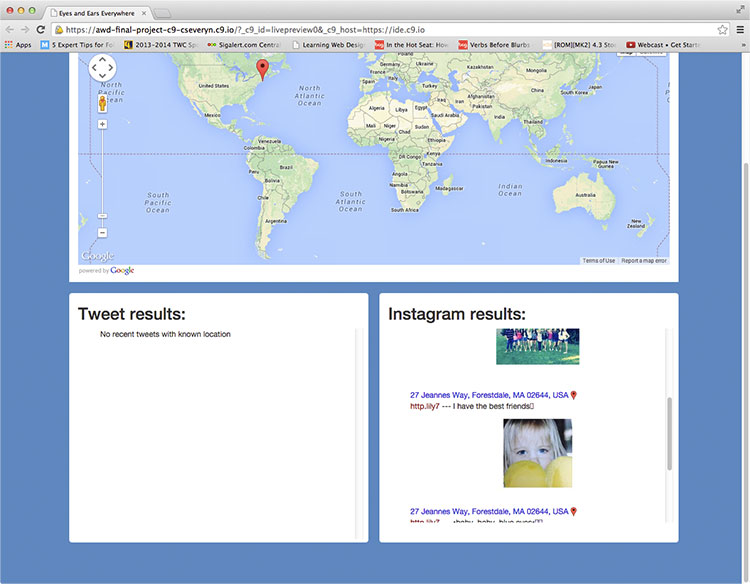
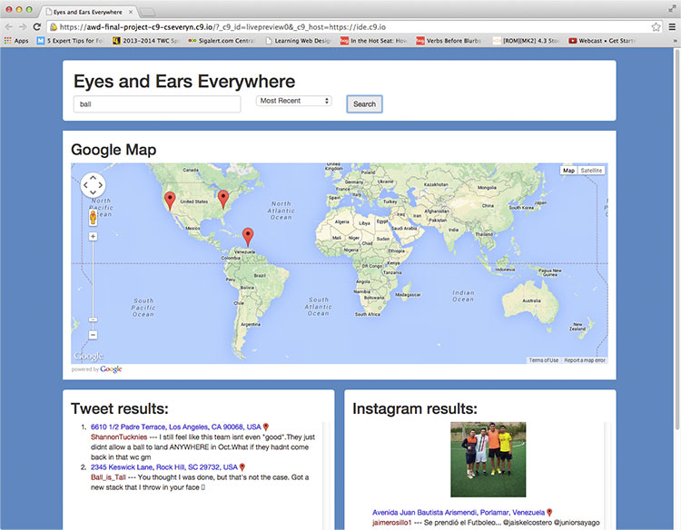

  
`School Work - Advanced Web Design Class - ITI-323`  

# Dates:  
2013 - 2014  
# Technologies:  
Cloud9, HTML5, CSS3, Bootstrap 3, AJAX, jQuery, Twitter API, Instagram API, Google Maps API  
# Description:  
This final project uses 3 different APIs (Twitter, Instagram, Google Maps) to search for given terms on both Twitter and Instagram simultaneously and maps them on Google Maps if a location is present in any of the results.  The webpage was created with HTML5, CSS3, Bootstrap 3, AJAX, jQuery, Twitter API, Instagram API, Google Maps API in [Cloud9 - https://c9.io](https://c9.io/).  
# Screenshots:
  

  

  

  

  

  

  

  

  

  

  

  
